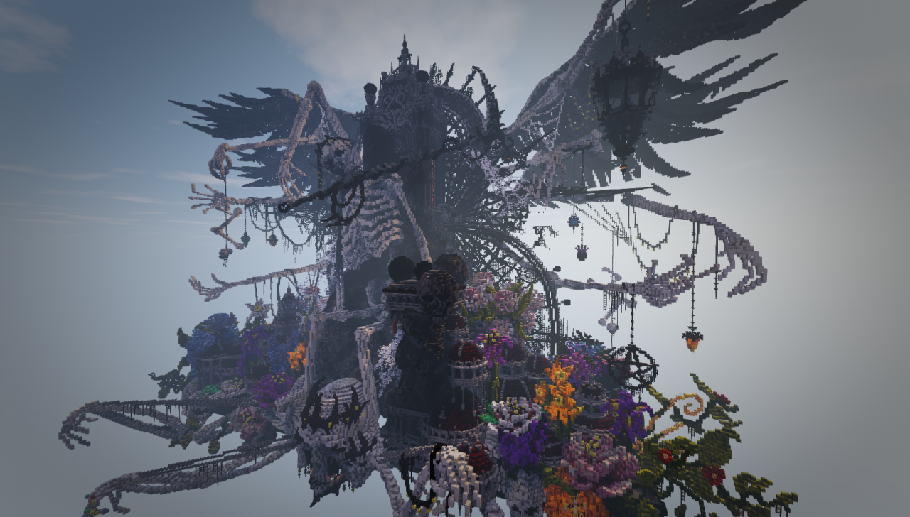

# Aesthetics

When designing and developing games, it is important to narrowly define the reactions a game should evoke in players.

Without precise definitions for these outcomes:
- How can developers design games to target these outcomes?
- How can developers balance our efforts between these outcomes?
- How can developers communicate about our game to potential players?
- How can play testers provide effective feedback?

To provide structure to game analysis, Robin Hunicke, Marc LeBlanc, and Robert Zubek established a taxonomy of "fun"-types (or "aesthetics") to categorize the most common outcomes desired by game devs.
{{footnote: [Robin Hunicke, Marc LeBlanc, Robert Zubek. *MDA: A Formal Approach to Game Design and Game Research*.](https://users.cs.northwestern.edu/~hunicke/pubs/MDA.pdf)}}

<!-- slider slide -->
<!-- slider cell-split -->

<div style="width: 50%; margin: auto;">


</div>

*[Image from Mvoltz, hosted by Wikimedia Commons](https://commons.wikimedia.org/wiki/File:Kawaii_magnifying_glass_black_and_white_clipart.svg)*

<!-- slider both -->

<!-- slider split -->

<!-- slider slide -->

# What is "Fun"?

<!-- slider both -->


``` admonish quote title="MDA: A Formal Approach to Game Design and Game Research"
What makes a game "fun"? How do we know a specific type of fun when we see it? Talking about games and play is hard because the vocabulary we use is relatively limited.

In describing the aesthetics of a game, we want to move away from words like "fun" and "gameplay" towards a more directed vocabulary. This includes but is not limited to the taxonomy listed here:

1. **Sensation** - Game as sense-pleasure
2. **Fantasy** - Game as make-believe
3. **Narrative** - Game as drama
4. **Challenge** - Game as obstacle course
5. **Fellowship** - Game as social framework
6. **Discovery** - Game as uncharted territory
7. **Expression** - Game as self-discovery
8. **Submission** - Game as pastime

```

<!-- slider split -->

## A Word of Caution

<!-- slider row-split -->

Examples for of these aesthetics will be provided, but keep in mind that these laws aren't strictly "true" in the same sense that math is true.

There may be desired aesthetics that do not fit into these categories.
There may be desired aesthetics that exist at the border between these categories.

The important part is that the desired outcomes are defined precisely enough to support effective communication about how they are achieved.

<!-- slider slide -->
<!-- slider cell-split -->

<div style="width: 80%; margin: auto;">


*[Public domain, hosted by Wikimedia Commons](https://commons.wikimedia.org/wiki/File:Singapore_road_sign_-_Warning_-_Quayside_or_river_bank.svg)*

</div>
<!-- slider both -->

<!-- slider split -->
## Sensation

> "Game as sense-pleasure"

<!-- slider row-split -->

The sensation aesthetic provides pleasurable/enjoyable sensations to players. This includes, beautiful scenery, enjoyable music, and satisfying haptic feedback from a controller.

### Concrete examples

- Red Dead Redemption 2 : well known for its natural scenery
- Undertale : well known for its soundtrack
- Luigi's Mansion : uses haptic feedback to indicate strain when catching ghosts

<!-- slider slide -->
<!-- slider cell-split -->


*[Image of Red Dead Redemption 2, taken from YouTube, included under fair use.](https://www.youtube.com/watch?v=pIrLsiq0QNg&t=24s)*

<!-- slider both -->

<!-- slider split -->
## Fantasy

> "Game as make-believe"

<!-- slider row-split 2 -->

The fantasy aesthetic allows players to do things or be things that they normally couldn't. This includes acting in roles one does not have the skills for, or that practicality/social structures wouldn't allow. This also includes the provision of superhuman abilities and the limitation of common abilities.

### Concrete Examples

- Halo : Has players act as a space marine fighting for the fate of humanity.
- Payday : Has players act as a criminal performing heists.
- Psychonauts : Has players explore people's minds.
- Endoparasitic : Has players fight monsters as a triple amputee.


<!-- slider slide -->
<!-- slider cell-split -->


*[Promotional image of Payday 3, taken from the official website, included under fair use.](https://www.paydaythegame.com/payday3/https://www.youtube.com/watch?v=pIrLsiq0QNg&t=24s)*

<!-- slider both -->

<!-- slider split -->
## Narrative

> "Game as drama"

<!-- slider row-split -->

The narrative aesthetic provides stories to players.
This is related to, but not the same as fantasy.
A sandbox game that allows one to destroy planets may have fantasy, but it doesn't have narrative.
Likewise, stories can have players take roles that aren't much different from themselves.

### Concrete Examples

- Bioshock : Unravels the story of a dying underwater city
- Disco Elysium : The adventures of a cop whose life and mind has fallen apart

<!-- slider slide -->
<!-- slider cell-split -->

<div style="width: 80%; margin: auto;">


*Image of Disco Elysium, included under fair use.*

</div>

<!-- slider both -->


<!-- slider split -->
## Challenge

> "Game as obstacle course"

<!-- slider row-split 4 -->

The challenge aesthetic gives players an opportunity to test and improve their skills at difficult tasks.

Crucially, *challenge is not difficulty alone*.
The aim is to give players a *rewarding* challenge.
Games that deliver challenge well usually have a structure of obstacles that is realistic to overcome.
They also usually provide features/infrastructure that support players in their development.

### Concrete Examples

- Sekiro : Challenges emphasize strategy and timing, and provides a system of abilities to counter enemies and cues to predict attacks.
- Super Meat Boy : Challenges emphasize movement mechanics, and provides a rapid respawn mechanic to streamline learning through many deaths.

<!-- slider slide -->
<!-- slider cell-split 2 -->


*Image of Super Meatboy, included under fair use.*

<!-- slider both -->

<!-- slider split -->
## Fellowship

> "Game as social framework"

<!-- slider row-split -->

The fellowship aesthetic gives players an opportunity to build comradery with other players through community, conversation, teamwork, etc.

### Concrete Examples
- Final Fantasy Online : Encourages people to tackle challenges in groups. Provides tools for social interactions.
- Portal 2 Co-op : Puzzle solutions require teamwork to execute. Game encourages communication and cooperative exploration of problems.

<!-- slider slide -->
<!-- slider cell-split -->


*[Image of Portal 2 promotional footage, included under fair use.](https://www.youtube.com/watch?v=A88YiZdXugA)*

<!-- slider both -->

<!-- slider split -->
## Discovery

> "Game as uncharted territory"

<!-- slider row-split -->

The discovery aesthetic allows provides players an opportunity to uncover new things.
This can include concrete things, such as characters or settings, or more abstract things, such as interactions between mechanics.

### Concrete Examples
- Dwarf Fortress : Provides an incredibly complex, interconnected set of rules for players to learn and apply.
- The Yakuza Series : Provides rich environments populated densely with interesting details.

<!-- slider slide -->
<!-- slider cell-split -->


*Image of Yakuza Zero, included under fair use.*

<!-- slider both -->

<!-- slider split -->
## Expression

> "Game as self-discovery"

<!-- slider row-split -->

The expression aesthetic provides players the ability to express themselves through their actions in game and their effects on the game world.

### Concrete Examples
- Minecraft : Allows players to create a wide variety of items and structures in the game world.
- Disco Elysium : Allows players to cultivate one of a multitude of personas through their choices in dialogue.

<!-- slider slide -->
<!-- slider cell-split -->


*[Minecraft sculpture, by Uchio Tokura, included under fair use.](https://www.planetminecraft.com/project/flowercorpse-abs-application/)*

<!-- slider both -->

<!-- slider split -->


## Submission

> "Games as pastime"

<!-- slider row-split -->

The submission aesthetic allows a player to relax/meditate by performing simple tasks that require little mental effort.

### Concrete Examples

- World of Warcraft : Resources/power are commonly accumulated through the repeated completion of simple tasks (grinding).
- Cookie Clicker : The game, ostensibly about clicking a cookie, is actually about managing a layered system of feedback loops that increase the rate of cookie clicking.

<!-- slider slide -->
<!-- slider cell-split -->

<div style="width: 60%; margin: auto;">


*Image of Cookie Clicker's thrilling gameplay, included under fair use.*

</div>

<!-- slider both -->
