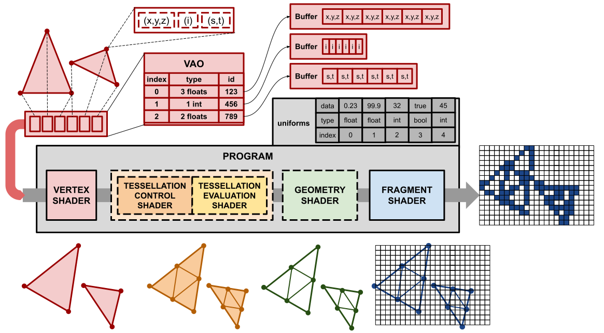

# The Graphics Pipeline

As mentioned in the last sub-chapter, this textbook will be discussing graphics through the OpenGL API.
While other APIs will represent concepts differently, much of the underlying concepts are the same.

Rendering in OpenGL is based upon a **pipeline**, a sequence of programs that operate upon individual units of a stream of data.
The programs that make up the classic rendering pipeline are called **shaders** and they come in 5 different types:

- Vertex shader
- Tesselation control shader
- Tesselation evaluation shader
- Geometry shader
- Fragment shader

A collection of shaders forming a pipeline is itself referred to as a "Program", though each of its shaders are sort of programs in their own right.

Up to one shader of any of these types can be included in a pipeline, though not all are required.
While the rendering pipelne must have a **vertex shader** and a **fragment shader**, the remainder are optional, however both tesselation shaders must be included if any are.

*A diagram of the OpenGL graphics pipeline*

## The OpenGL Context

Before we can begin discussing how a graphics pipeline is configured, we must discuss how OpenGL organizes its resources and state.

### Object IDs

OpenGL, like GLFW, works through a context. Unlike GLFW, OpenGL's context is meant to be safe to interact with and compatible across various languages.
To support this, an OpenGL context does not provide pointer references to resources.
Instead, it assigns integer IDs that map onto a set of resources.
Through this scheme, an OpenGL context can check if an ID is valid and if it is associated with the correct type of object before performing operations, allowing it to detect and prevent misuse of resources.

### Bind Points

OpenGL provides a set of **bind points** for objects, with the set of valid bind points depending upon the type of object being bound.
For all intents and purposes, these bind points are predefined global variables.
They may be set from anywhere, no more can be created, and setting a bind point in one scope sets that bind point for all scopes.

### Buffers

OpenGL represents data through **buffers**.
Buffers are essentially just chunks of raw bytes that can be plugged into other parts of the context to supply inputs or accept outputs.
In order to ascribe meaning to the content of a buffer, one must supply additional information representing that data, as we will discuss later with vertex attribute objects.

## Inputs

Before we can explain what each shader does, it is important to understand what is being provided as an input to the first (vertex) shader.

Graphics pipelines work by processing a set of primitives, simple pieces of geometry such as lines, triangles, quadrilaterals, points, etc.
A set of primitives is presented to the pipeline as a stream of vertexes, with every **N** vertexes grouped together to form the points that make up each primitive.

The number of points per primitive depends upon the primitive itself, points have one point per primitive, lines have two points, triangles have three points, etc.
Whatever **N** is, a point at index **Nx** in the stream forms a primitive with the following points up to (and including) index **Nx+N-1**.

For a given stream of vertexes, all vertexes in that stream are assigned values for the same set of **attributes**.
Attributes may include the position of the vertex, the color of the vertex, the location on a texture that corresponds with that vertex, etc.
The attributes provided to a program are determined by the current **Vertex Attribute Object** (VAO).
A VAO is essentially a table that associates a given index with a type and a buffer ID.
In this way, each entry is like a pointer, providing a base type as well as an "address" of where the instances of that type are stored.

There is only on VAO bindpoint, and whatever VAO is bound to that bindpoint is the one that acts as an input to the rendering pipeline.

To allow programs to specify inputs that are the same across every element (e.g. vertex) being processed by a shader, each rendering program has an associated table of **uniforms**.
Uniforms are always the same value to each shader invocation across a pipeline execution.

## Vertex Shaders

Vertex shaders process the initial inputs of their corresponding pipeline, with each invocation of a shader processing a specific vertex.
To the shader, these inputs are exposed through things that look like global variables called **input variables**.
Through execution, an invocation of a shader will write to similar-looking variables called **output variables**.

For any given shader, each **input variable** corresponds to an attribute associated with the input element, and each **output variable** corresponds with an attribute for the produced element.
In the case of vertex shaders, both the inputs and outputs are vertexes.

The job of a vertex shader is to position geometry correctly so that it can appear on screen.
For OpenGL, the x/y/y coordinates with x/y between 0 and 1 and z between 0 and -1 counts as the "screen".
As x increases from 0 to 1, the corresponding position on the image being rendered moves from he left-hand edge to the right-hand edge.
Similarly, y=0 and y=1 represent the bottom and top edges of the image.
Finally, z=-1 represents the furthest objects that are viewable on the screen.

Vertexes that are located relative to this concept of the screen's canonical boundaries are in **screen space**.

Through a series of matrix multiplications, a vertex can be moved so that it occupies its correct location in screen space.
During this process, a vertex shader mamy provide any number of additional modifictions to his mapping, allowing for more interesting effects.

## Tesselation Shaders

Tesselations shaders are shaders that selectively subdivide primitives into additional primitives.
These are conventionally used to add detail to models dynamically in response to factors that can quickly change.

## Geomtry Shaders

Geometry shaders are shaders that may transform any type of input primitive into another type of primitive (e.g. turning a triangle into just the lines making up its edges.)
They are a little less in use today, since they have some performance/efficiency concerns, but are still quite flexible.

## Fragment Shaders

Fragment shaders do not operate on vertexes or primitives.
Instead, whatever set of primitives are produced by the last (defined) shader before the fragment shader gets projected onto a grid according to the screen-space coordinates of their points.
With this projection, the area of cells in this grid that overlap with the primitive are assigned **fragments**.

This grid is called a framebuffer, and each cell in that grid stores a color (as well as a depth, depending upon configurations).
Each fragment generated for a primitive is assigned attributes that are a weighted average between the points on the primitive.
The weighting of attributes is based upon the spatial distance of the fragment relative to each vertex making up the primitive.
The closer a fragment is to a vertex, the more its attributes approach the outputs of the prior shader.

*For example, if each of the vertexes in this triangle was assigned a 3-component color, one vertex being pure red, another being pure green, and the remaining being pure blue, the resulting color for each fragment would look like the above image.*

After processing, a fragment shader outputs a color and depth that are potentially written to the framebuffer.
Usually, if **depth testing** is enabled, the color output by a fragment is only written to its element in the framebuffer if it has a less negative depth value, making it "in front of" whatever was previously written to the framebuffer.

